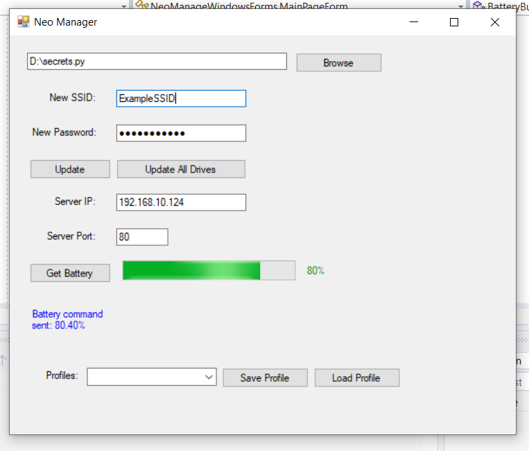

# Neo Manager Windows Forms Application

The Neo Manager Windows Forms application allows you to manage secrets (SSID and password) in Python files, retrieve battery information from a server using TCP, and save/load user profiles for quick configuration. This README provides a comprehensive guide on how to use the program.

## System Requirements
- Windows operating system (Windows 7 or later)
- .NET Framework 4.5 or later

## Getting Started

1. **Clone or Download**: Clone this repository or download the entire project as a ZIP file to your local machine.

2. **Open the Solution**: Open the provided solution (`NeoManageWindowsForms.sln`) in a compatible C# development environment, such as Visual Studio.

3. **Build Solution**: Build the solution to ensure all dependencies are resolved and the application is ready for execution.

4. **Run the Application**: Run the application by pressing the "Start" button in your development environment. The Neo Manager Windows Forms application will launch.

## Using the Application

When you launch Neo Manager, you will be presented with the main user interface, which consists of several components:

- **FileEntry**: A textbox to input or display the path of the Python file to be updated.
- **SSIDEntry**: A textbox to enter the new SSID.
- **PasswordEntry**: A textbox to enter the new password.
- **ServerIPEntry**: A textbox to enter the server IP for battery information retrieval.
- **ServerPortEntry**: A textbox to enter the server port for battery information retrieval.
- **StatusLabel**: A label to display status messages.
- **BatteryProgressBar**: A progress bar to show the battery percentage.
- **BatteryPercentageLabel**: A label to display the battery percentage.

### Update Secrets in a File

1. **Browse**: Click the "Browse" button to select the Python file that contains the secrets on the drive you want to update.

2. **New SSID**: Enter the new SSID (Wi-Fi network name) that you want to set.

3. **New Password**: Enter the new password that you want to set.

4. **Update**: Click the "Update" button to update the SSID and password in the selected Python file.

### Update Secrets on All Drives

1. **New SSID**: Enter the new SSID (Wi-Fi network name) that you want to set.

2. **New Password**: Enter the new password that you want to set.

3. **Update All Drives**: Click the "Update All Drives" button to update the SSID and password in all 'secrets.py' files on all available drives. Note that this operation may take some time as it searches all drives.

### Retrieve Battery Information

1. **Server IP**: Enter the IP address of the Neofeather where you want to retrieve battery information.

2. **Server Port**: Enter the port number on which the Neofeather is listening for connections.

3. **Get Battery**: Click the "Get Battery" button to send a battery command to the Neofeather using TCP and display the response. The application will repeatedly check for a response from the Neofeather and update the status label once a response is received.

### Save and Load User Profiles

1. **Profiles**: The dropdown list allows you to select saved user profiles.

2. **Save Profile**: Enter a name for the current configuration and click the "Save Profile" button to save the current settings as a user profile. The profile will be added to the dropdown list for easy selection.

3. **Load Profile**: Select a user profile from the dropdown list and click the "Load Profile" button to load the saved settings for that profile. The settings will be populated in the respective input fields.

## Notes

- The application supports AES encryption for passwords. When updating secrets, the provided password is encrypted and stored in the 'secrets.py' file.
- When updating secrets on all drives, the application asynchronously searches for all 'secrets.py' files and updates them one by one. This operation may take time, especially if you have multiple drives.
- Remember that the application uses a Windows Forms interface, so it's designed to run on Windows systems.

## Troubleshooting
- If you encounter any errors or unexpected behavior, make sure you have met the system requirements and that the Python files are in the correct format or not corrupted.
- If the battery retrieval feature does not work, ensure that the server IP and port are correctly entered.
